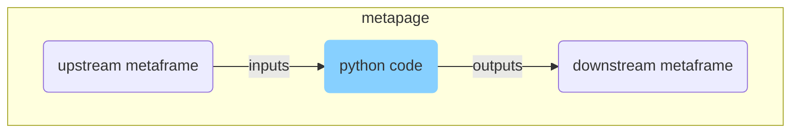

# Python [metaframe](https://docs.metapage.io/docs) (via pyiodide)



 - Run python code entire in the browser, and connect to other metaframes
 - Edit python code directly in the frame
 - All code and configuration is stored in the URL
   - shareable and durable

## Configuration + Inputs/Outputs

There are two (metaframe) modes (set in ⚙️ Options):

1. `✅ Re-run python code on new inputs`: Anytime new metaframe inputs arrive, restart the script. Any files in `/outputs` are copied and send as metaframe outputs. If the file suffix is recognized (e.g. `.js`, `.json`, `.py`) then it will be sent as a string (or directly as JSON if ending in `.json`), otherwise it will be send as an ArrayBuffer.
   - Inputs **are** copied as files
2. `❌ Re-run python code on new inputs`: Run the script once, the script is responsible for listening to inputs by calling the metaframe object (see examples below).
   - Inputs are **not** copied as files 
  
The use case of copying inputs and outputs as files but **not* re-running seems counterintuitive to me, let me know if you have this use case: https://github.com/metapages/metaframe-py/issues

## Useful code snippets

### Get the (current) metaframe inputs

```python
from js import metaframe

inputs = metaframe.getInputs().as_object_map()

for key in inputs:
    print(key)
    print(inputs[key])
    # Do something with the value
```

### Listen to new metaframe inputs

```python
from pyodide.ffi import create_proxy
from js import metaframe

def onInputs(*args):
    print('got inputs in python:')
    inputs = args[0].as_object_map()
    for key in inputs:
      print(key)

onInputsProxy = create_proxy(onInputs) 
disposer = metaframe.onInputs(onInputsProxy)
# Call the disposer via the scriptUnload described next below

```

### Unload/cleanup/dispose

When iterating/editing, the python script is repeatedly run in the `pyiodide` object. This can cause problems if proxied `js <-> python` objects are not properly disposed.

Before every new python script execution, (in javascript) if a `window.scriptUnload` script exists, it is called. This is where you put your cleanup:

```python
from pyodide.ffi import create_proxy
from js import window

# Put this at the end of your script:
def scriptUnload(*args):
    print('unloading from python')
    # Call your cleanup code here
proxy_scriptUnload = create_proxy(scriptUnload)
window.scriptUnload = proxy_scriptUnload
```

## Advanced

- Testing, capabilities, development metapage: 
  - https://app.metapage.io/dion/py.mtfm.io-test/view
- Example metapage running python with inputs and outputs:


