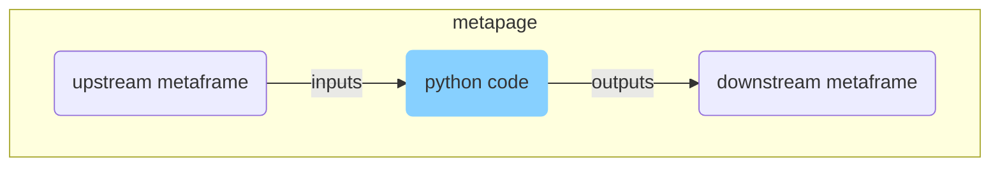

# Python [metaframe](https://docs.metapage.io/docs) (via pyiodide)



Examples:
 - [create matplotlib plots](https://app.metapages.org/#?definition=JTdCJTIybWV0YSUyMiUzQSU3QiUyMmxheW91dHMlMjIlM0ElN0IlMjJyZWFjdC1ncmlkLWxheW91dCUyMiUzQSU3QiUyMmRvY3MlMjIlM0ElMjJodHRwcyUzQSUyRiUyRnd3dy5ucG1qcy5jb20lMkZwYWNrYWdlJTJGcmVhY3QtZ3JpZC1sYXlvdXQlMjIlMkMlMjJsYXlvdXQlMjIlM0ElNUIlN0IlMjJoJTIyJTNBMyUyQyUyMmklMjIlM0ElMjJpbWFnZTElMjIlMkMlMjJtb3ZlZCUyMiUzQWZhbHNlJTJDJTIyc3RhdGljJTIyJTNBZmFsc2UlMkMlMjJ3JTIyJTNBMTIlMkMlMjJ4JTIyJTNBMCUyQyUyMnklMjIlM0EyJTdEJTJDJTdCJTIyaCUyMiUzQTUlMkMlMjJpJTIyJTNBJTIyaW1hZ2UyJTIyJTJDJTIybW92ZWQlMjIlM0FmYWxzZSUyQyUyMnN0YXRpYyUyMiUzQWZhbHNlJTJDJTIydyUyMiUzQTEyJTJDJTIyeCUyMiUzQTAlMkMlMjJ5JTIyJTNBNSU3RCUyQyU3QiUyMmglMjIlM0EyJTJDJTIyaSUyMiUzQSUyMnB5aW9kaWRlLWRldiUyMiUyQyUyMm1vdmVkJTIyJTNBZmFsc2UlMkMlMjJzdGF0aWMlMjIlM0FmYWxzZSUyQyUyMnclMjIlM0ExMiUyQyUyMnglMjIlM0EwJTJDJTIyeSUyMiUzQTAlN0QlNUQlMkMlMjJwcm9wcyUyMiUzQSU3QiUyMmNvbHMlMjIlM0ExMiUyQyUyMmNvbnRhaW5lclBhZGRpbmclMjIlM0ElNUI1JTJDNSU1RCUyQyUyMm1hcmdpbiUyMiUzQSU1QjEwJTJDMjAlNUQlMkMlMjJyb3dIZWlnaHQlMjIlM0ExMDAlN0QlN0QlN0QlMkMlMjJuYW1lJTIyJTNBJTIyQSUyMG5ldyUyMGtpbmQlMjBvZiUyMHB1Ymxpc2hpbmclMjAtJTIwc2VsZi1jb250YWluZWQlMjBVUkxTJTIyJTdEJTJDJTIybWV0YWZyYW1lcyUyMiUzQSU3QiUyMmltYWdlMSUyMiUzQSU3QiUyMmlucHV0cyUyMiUzQSU1QiU3QiUyMm1ldGFmcmFtZSUyMiUzQSUyMnB5aW9kaWRlLWRldiUyMiUyQyUyMnNvdXJjZSUyMiUzQSUyMmltYWdlMSUyMiUyQyUyMnRhcmdldCUyMiUzQSUyMmltYWdlMSUyMiU3RCU1RCUyQyUyMnVybCUyMiUzQSUyMmh0dHBzJTNBJTJGJTJGanMubXRmbS5pbyUyRiUyMyUzRmVkaXQlM0QxJTI2anMlM0RZMjl1YzNRbE1qQnliMjkwSlRJd0pUTkVKVEl3Wkc5amRXMWxiblF1WjJWMFJXeGxiV1Z1ZEVKNVNXUW9KVEl5Y205dmRDVXlNaWtsTUVFbE1FRjJZWElsTWpCdmJrbHVjSFYwY3lVeU1DVXpSQ1V5TUdsdWNIVjBjeVV5TUNVelJDVXpSU1V5TUNVM1FpVXdRU1V5TUNVeU1DVXlNQ1V5TUdOdmJuTjBKVEl3YXlVeU1DVXpSQ1V5TUU5aWFtVmpkQzVyWlhsektHbHVjSFYwY3lrbE5VSXdKVFZFSlROQ0pUQkJKVEl3SlRJd0pUSXdKVEl3YVdZbE1qQW9JU2hySlRJd0pUSTJKVEkySlRJd2FXNXdkWFJ6SlRWQ2F5VTFSQ2twSlRJd0pUZENKVEJCSlRJd0pUSXdKVEl3SlRJd0pUSXdKVEl3SlRJd0pUSXdjbVYwZFhKdUpUTkNKVEJCSlRJd0pUSXdKVEl3SlRJd0pUZEVKVEJCSlRJd0pUSXdKVEl3SlRJd1kyOXVjM1FsTWpCMkpUSXdKVE5FSlRJd2FXNXdkWFJ6SlRWQ2F5VTFSQ1V3UVNVeU1DVXlNQ1V5TUNVeU1IWmhjaVV5TUdsdFlXZGxKVEl3SlRORUpUSXdaRzlqZFcxbGJuUXVZM0psWVhSbFJXeGxiV1Z1ZENnbmFXMW5KeWtsTTBJbE1FRWxNRGxwYldGblpTNXpjbU1sTWpBbE0wUWxNakIwZVhCbGIyWW9kaWtsTWpBbE0wUWxNMFFsTTBRbE1qQWxNakp6ZEhKcGJtY2xNaklsTWpBbE1qWWxNallsTWpCMkxuTjBZWEowYzFkcGRHZ29KVEl5WkdGMFlTVXpRV2x0WVdkbEpUSXlLU1V5TUNVelJpVXlNSFlsTWpBbE0wRWxNakJWVWt3dVkzSmxZWFJsVDJKcVpXTjBWVkpNS0hZcEpUTkNKVEJCSlRJd0pUSXdKVEl3SlRJd2QyaHBiR1VsTWpBb2NtOXZkQzVtYVhKemRFTm9hV3hrS1NVeU1DVTNRaVV3UVNVeU1DVXlNQ1V5TUNVeU1DVXlNQ1V5TUNVeU1DVXlNSEp2YjNRdWNtVnRiM1psUTJocGJHUW9jbTl2ZEM1c1lYTjBRMmhwYkdRcEpUTkNKVEJCSlRJd0pUSXdKVEl3SlRJd0pUZEVKVEJCSlRJd0pUSXdKVEl3SlRJd2NtOXZkQzVoY0hCbGJtUkRhR2xzWkNocGJXRm5aU2tsTTBJbE1FRWxOMFFsTUVFbE1FRnZia2x1Y0hWMGN5aHRaWFJoWm5KaGJXVXVaMlYwU1c1d2RYUnpLQ2twSlRCQkpUQkJZMjl1YzNRbE1qQmthWE53YjNObEpUSXdKVE5FSlRJd2JXVjBZV1p5WVcxbExtOXVTVzV3ZFhSektHOXVTVzV3ZFhSektTVXdRWGRwYm1SdmR5NXpZM0pwY0hSVmJteHZZV1FsTWpBbE0wUWxNakFvS1NVeU1DVXpSQ1V6UlNVeU1DVTNRaVV3UVNVd09XUnBjM0J2YzJVb0tTVXdRU1UzUkElM0QlM0QlMjZtb2R1bGVzJTNESlRWQ0pUVkUlMjIlN0QlMkMlMjJpbWFnZTIlMjIlM0ElN0IlMjJpbnB1dHMlMjIlM0ElNUIlN0IlMjJtZXRhZnJhbWUlMjIlM0ElMjJweWlvZGlkZS1kZXYlMjIlMkMlMjJzb3VyY2UlMjIlM0ElMjJpbWFnZTIlMjIlMkMlMjJ0YXJnZXQlMjIlM0ElMjJpbWFnZTIlMjIlN0QlNUQlMkMlMjJ1cmwlMjIlM0ElMjJodHRwcyUzQSUyRiUyRmpzLm10Zm0uaW8lMkYlMjMlM0ZlZGl0JTNEMSUyNmpzJTNEWTI5dWMzUWxNakJ5YjI5MEpUSXdKVE5FSlRJd1pHOWpkVzFsYm5RdVoyVjBSV3hsYldWdWRFSjVTV1FvSlRJeWNtOXZkQ1V5TWlrbE1FRWxNRUYyWVhJbE1qQnZia2x1Y0hWMGN5VXlNQ1V6UkNVeU1HbHVjSFYwY3lVeU1DVXpSQ1V6UlNVeU1DVTNRaVV3UVNVeU1DVXlNQ1V5TUNVeU1HTnZibk4wSlRJd2F5VXlNQ1V6UkNVeU1FOWlhbVZqZEM1clpYbHpLR2x1Y0hWMGN5a2xOVUl3SlRWRUpUTkNKVEJCSlRJd0pUSXdKVEl3SlRJd2FXWWxNakFvSVNockpUSXdKVEkySlRJMkpUSXdhVzV3ZFhSekpUVkNheVUxUkNrcEpUSXdKVGRDSlRCQkpUSXdKVEl3SlRJd0pUSXdKVEl3SlRJd0pUSXdKVEl3Y21WMGRYSnVKVE5DSlRCQkpUSXdKVEl3SlRJd0pUSXdKVGRFSlRCQkpUSXdKVEl3SlRJd0pUSXdZMjl1YzNRbE1qQjJKVEl3SlRORUpUSXdhVzV3ZFhSekpUVkNheVUxUkNVd1FTVXlNQ1V5TUNVeU1DVXlNSFpoY2lVeU1HbHRZV2RsSlRJd0pUTkVKVEl3Wkc5amRXMWxiblF1WTNKbFlYUmxSV3hsYldWdWRDZ25hVzFuSnlrbE0wSWxNRUVsTURscGJXRm5aUzV6Y21NbE1qQWxNMFFsTWpCMGVYQmxiMllvZGlrbE1qQWxNMFFsTTBRbE0wUWxNakFsTWpKemRISnBibWNsTWpJbE1qQWxNallsTWpZbE1qQjJMbk4wWVhKMGMxZHBkR2dvSlRJeVpHRjBZU1V6UVdsdFlXZGxKVEl5S1NVeU1DVXpSaVV5TUhZbE1qQWxNMEVsTWpCVlVrd3VZM0psWVhSbFQySnFaV04wVlZKTUtIWXBKVE5DSlRCQkpUSXdKVEl3SlRJd0pUSXdkMmhwYkdVbE1qQW9jbTl2ZEM1bWFYSnpkRU5vYVd4a0tTVXlNQ1UzUWlVd1FTVXlNQ1V5TUNVeU1DVXlNQ1V5TUNVeU1DVXlNQ1V5TUhKdmIzUXVjbVZ0YjNabFEyaHBiR1FvY205dmRDNXNZWE4wUTJocGJHUXBKVE5DSlRCQkpUSXdKVEl3SlRJd0pUSXdKVGRFSlRCQkpUSXdKVEl3SlRJd0pUSXdjbTl2ZEM1aGNIQmxibVJEYUdsc1pDaHBiV0ZuWlNrbE0wSWxNRUVsTjBRbE1FRWxNRUZ2YmtsdWNIVjBjeWh0WlhSaFpuSmhiV1V1WjJWMFNXNXdkWFJ6S0NrcEpUQkJKVEJCWTI5dWMzUWxNakJrYVhOd2IzTmxKVEl3SlRORUpUSXdiV1YwWVdaeVlXMWxMbTl1U1c1d2RYUnpLRzl1U1c1d2RYUnpLU1V3UVhkcGJtUnZkeTV6WTNKcGNIUlZibXh2WVdRbE1qQWxNMFFsTWpBb0tTVXlNQ1V6UkNVelJTVXlNQ1UzUWlVd1FTVXdPV1JwYzNCdmMyVW9LU1V3UVNVM1JBJTNEJTNEJTI2bW9kdWxlcyUzREpUVkNKVFZFJTIyJTdEJTJDJTIycHlpb2RpZGUtZGV2JTIyJTNBJTdCJTIyaW5wdXRzJTIyJTNBJTVCJTdCJTIybWV0YWZyYW1lJTIyJTNBJTIyaW5wdXQlMjIlMkMlMjJzb3VyY2UlMjIlM0ElMjJ0ZXh0JTIyJTJDJTIydGFyZ2V0JTIyJTNBJTIydGV4dCUyMiU3RCUyQyU3QiUyMm1ldGFmcmFtZSUyMiUzQSUyMmdlbmVyYXRlLWlucHV0cyUyMiUyQyUyMnNvdXJjZSUyMiUzQSUyMiolMjIlMkMlMjJ0YXJnZXQlMjIlM0ElMjIqJTIyJTdEJTVEJTJDJTIydXJsJTIyJTNBJTIyaHR0cHMlM0ElMkYlMkZweS5tdGZtLmlvJTJGJTIzJTNGZWRpdCUzRDElMjZvcHRpb25zJTNESlRkQ0pUSXljaVV5TWlVelFYUnlkV1VsTjBRJTNEJTI2cHklM0RhVzF3YjNKMEpUSXdjSGx2Wkdsa1pTVXdRV2x0Y0c5eWRDVXlNRzFwWTNKdmNHbHdKVEJCWm5KdmJTVXlNR3B6SlRJd2FXMXdiM0owSlRJd2JXVjBZV1p5WVcxbEpUSkRKVEl3Ykc5bkpUQkJKVEJCWVhkaGFYUWxNakJ0YVdOeWIzQnBjQzVwYm5OMFlXeHNLQ1V5TW0xaGRIQnNiM1JzYVdJbE1qSXBKVEJCWVhkaGFYUWxNakJ0YVdOeWIzQnBjQzVwYm5OMFlXeHNLQ1V5TW01MWJYQjVKVEl5S1NVd1FTVXdRV2x0Y0c5eWRDVXlNRzFoZEhCc2IzUnNhV0l1Y0hsd2JHOTBKVEl3WVhNbE1qQndiSFFsTUVGcGJYQnZjblFsTWpCcGJ5VXlReVV5TUdKaGMyVTJOQ1V3UVdsdGNHOXlkQ1V5TUc1MWJYQjVKVEl3WVhNbE1qQnVjQ1V3UVNVd1FXeHZaeWdsTWpKUWVYUm9iMjRsTWpCemRHRnlkR1ZrSlRKREpUSXdZMjl0Y0hWMGFXNW5KVEl3Y0d4dmRITXVMaTRsTWpJcEpUQkJKVEJCYm5BdWNtRnVaRzl0TG5ObFpXUW9NVGsyT0RBNE1ERXBKVEl3SlRJd0pUSXpKVEl3YzJWbFpDVXlNSFJvWlNVeU1ISmhibVJ2YlNVeU1HNTFiV0psY2lVeU1HZGxibVZ5WVhSdmNpNGxNRUZrWVhSaEpUSXdKVE5FSlRJd0pUZENKMkVuSlROQkpUSXdibkF1WVhKaGJtZGxLRFV3S1NVeVF5VXdRU1V5TUNVeU1DVXlNQ1V5TUNVeU1DVXlNQ1V5TUNVeU1DZGpKeVV6UVNVeU1HNXdMbkpoYm1SdmJTNXlZVzVrYVc1MEtEQWxNa01sTWpBMU1DVXlReVV5TURVd0tTVXlReVV3UVNVeU1DVXlNQ1V5TUNVeU1DVXlNQ1V5TUNVeU1DVXlNQ2RrSnlVelFTVXlNRzV3TG5KaGJtUnZiUzV5WVc1a2JpZzFNQ2tsTjBRbE1FRmtZWFJoSlRWQ0oySW5KVFZFSlRJd0pUTkVKVEl3WkdGMFlTVTFRaWRoSnlVMVJDVXlNQ1V5UWlVeU1ERXdKVEl3S2lVeU1HNXdMbkpoYm1SdmJTNXlZVzVrYmlnMU1Da2xNRUZrWVhSaEpUVkNKMlFuSlRWRUpUSXdKVE5FSlRJd2JuQXVZV0p6S0dSaGRHRWxOVUluWkNjbE5VUXBKVEl3S2lVeU1ERXdNQ1V3UVNVd1FXWnBaeVV5UXlVeU1HRjRKVEl3SlRORUpUSXdjR3gwTG5OMVluQnNiM1J6S0dacFozTnBlbVVsTTBRb05TVXlReVV5TURJdU55a2xNa01sTWpCc1lYbHZkWFFsTTBRblkyOXVjM1J5WVdsdVpXUW5LU1V3UVdGNExuTmpZWFIwWlhJb0oyRW5KVEpESlRJd0oySW5KVEpESlRJd1l5VXpSQ2RqSnlVeVF5VXlNSE1sTTBRblpDY2xNa01sTWpCa1lYUmhKVE5FWkdGMFlTa2xNRUZoZUM1elpYUmZlR3hoWW1Wc0tDZGxiblJ5ZVNVeU1HRW5LU1V3UVdGNExuTmxkRjk1YkdGaVpXd29KMlZ1ZEhKNUpUSXdZaWNwSlRCQkpUQkJZblZtSlRJd0pUTkVKVEl3YVc4dVFubDBaWE5KVHlncEpUQkJabWxuTG5OaGRtVm1hV2NvWW5WbUpUSkRKVEl3Wm05eWJXRjBKVE5FSjNCdVp5Y3BKVEJCWW5WbUxuTmxaV3NvTUNrbE1FRnBiV2RmYzNSeUpUSXdKVE5FSlRJd0oyUmhkR0VsTTBGcGJXRm5aU1V5Um5CdVp5VXpRbUpoYzJVMk5DVXlReWNsTWpBbE1rSWxNakJpWVhObE5qUXVZalkwWlc1amIyUmxLR0oxWmk1eVpXRmtLQ2twTG1SbFkyOWtaU2duVlZSR0xUZ25LU1V3UVd4dlp5Z2xNakpUWlc1MEpUSXdhVzFoWjJVeElTVXlNaWtsTUVGdFpYUmhabkpoYldVdWMyVjBUM1YwY0hWMEtDVXlNbWx0WVdkbE1TVXlNaVV5UXlVeU1HbHRaMTl6ZEhJcEpUQkJKVEJCSlRCQlptbG5KVEpESlRJd1lYZ2xNakFsTTBRbE1qQndiSFF1YzNWaWNHeHZkSE1vS1NVd1FXRjRMbkJzYjNRb0pUVkNNU1V5UXpNbE1rTXlKVFZFS1NVd1FXSjFaaVV5TUNVelJDVXlNR2x2TGtKNWRHVnpTVThvS1NVd1FXWnBaeTV6WVhabFptbG5LR0oxWmlVeVF5VXlNR1p2Y20xaGRDVXpSQ2R3Ym1jbktTVXdRV0oxWmk1elpXVnJLREFwSlRCQmFXMW5YM04wY2lVeU1DVXpSQ1V5TUNka1lYUmhKVE5CYVcxaFoyVWxNa1p3Ym1jbE0wSmlZWE5sTmpRbE1rTW5KVEl3SlRKQ0pUSXdZbUZ6WlRZMExtSTJOR1Z1WTI5a1pTaGlkV1l1Y21WaFpDZ3BLUzVrWldOdlpHVW9KMVZVUmkwNEp5a2xNRUZzYjJjb0pUSXlVMlZ1ZENVeU1HbHRZV2RsTWlFbE1qSXBKVEJCYldWMFlXWnlZVzFsTG5ObGRFOTFkSEIxZENnbE1qSnBiV0ZuWlRJbE1qSWxNa01sTWpCcGJXZGZjM1J5S1ElM0QlM0QlMjIlN0QlN0QlMkMlMjJwbHVnaW5zJTIyJTNBJTVCJTIyaHR0cHMlM0ElMkYlMkZtZXJtYWlkLm10Zm0uaW8lMkYlMjMlM0ZobSUzRGRpc2FibGVkJTIyJTJDJTIyaHR0cHMlM0ElMkYlMkZlZGl0b3IubXRmbS5pbyUyRiUyMyUzRmhtJTNEZGlzYWJsZWQlMjZvcHRpb25zJTNESlRkQ0pUSXliVzlrWlNVeU1pVXpRU1V5TW1wemIyNGxNaklsTWtNbE1qSnpZWFpsYkc5aFpHbHVhR0Z6YUNVeU1pVXpRWFJ5ZFdVbE1rTWxNakowYUdWdFpTVXlNaVV6UVNVeU1uWnpMV1JoY21zbE1qSWxOMFElM0QlMjIlNUQlMkMlMjJ2ZXJzaW9uJTIyJTNBJTIyMC4zJTIyJTdE)
 - [inputs/outputs](https://app.metapage.io/dion/py.mtfm.io-test/view) 


 - Run python code entire in the browser, and connect to other metaframes
 - Edit python code directly in the frame
 - All code and configuration is stored in the URL
   - shareable and durable

## Configuration + Inputs/Outputs

There are two (metaframe) modes (set in ⚙️ Options):

1. `✅ Re-run python code on new inputs`: Anytime new metaframe inputs arrive, restart the script. Any files in `/outputs` are copied and send as metaframe outputs. If the file suffix is recognized (e.g. `.js`, `.json`, `.py`) then it will be sent as a string (or directly as JSON if ending in `.json`), otherwise it will be send as an ArrayBuffer.
   - Inputs **are** copied as files
2. `❌ Re-run python code on new inputs`: Run the script once, the script is responsible for listening to inputs by calling the metaframe object (see examples below).
   - Inputs are **not** copied as files 
  
The use case of copying inputs and outputs as files but **not* re-running seems counterintuitive to me, let me know if you have this use case: https://github.com/metapages/metaframe-py/issues

## Useful code snippets

### Get the (current) metaframe inputs

```python
from js import metaframe

inputs = metaframe.getInputs().as_object_map()

for key in inputs:
    print(key)
    print(inputs[key])
    # Do something with the value
```

### Listen to new metaframe inputs

```python
from pyodide.ffi import create_proxy
from js import metaframe

def onInputs(*args):
    print('got inputs in python:')
    inputs = args[0].as_object_map()
    for key in inputs:
      print(key)

onInputsProxy = create_proxy(onInputs) 
disposer = metaframe.onInputs(onInputsProxy)
# Call the disposer via the scriptUnload described next below

```

### Unload/cleanup/dispose

When iterating/editing, the python script is repeatedly run in the `pyiodide` object. This can cause problems if proxied `js <-> python` objects are not properly disposed.

Before every new python script execution, (in javascript) if a `window.scriptUnload` script exists, it is called. This is where you put your cleanup:

```python
from pyodide.ffi import create_proxy
from js import window

# Put this at the end of your script:
def scriptUnload(*args):
    print('unloading from python')
    # Call your cleanup code here
proxy_scriptUnload = create_proxy(scriptUnload)
window.scriptUnload = proxy_scriptUnload
```

### Logging to the main div

Some convenience functions:

```py

# log is the same as logStderr 
from js import log, logStdout, logStderr

# These functions only take a single string, no fancy formatting or multiple arguments
log("some string")
logStdout("some string")
logStderr("some error")
```

## Advanced

- Testing, input/outputs, capabilities, development metapage: 
  - https://app.metapage.io/dion/py.mtfm.io-test/view
- Example metapage running python with inputs and outputs and plotting:
  - https://app.metapage.io/dion/py.mtfm.io-example-01


